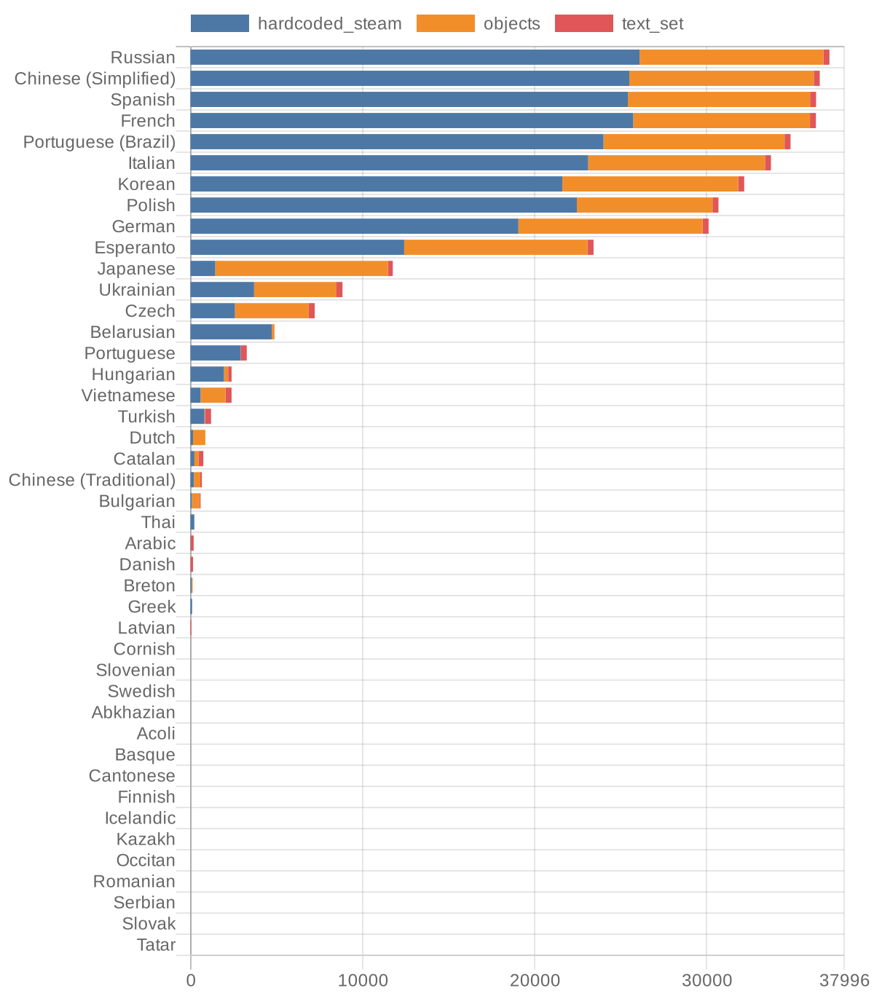

# autobuild

An automated repository which builds csv files with a translation for several languages to use with [dfint/df-steam-hook](https://github.com/dfint/df-steam-hook). It updates once a day on data from [dfint/translations-backup](https://github.com/dfint/translations-backup).

Ready to use csv files are in the [translation_build](https://github.com/dfint/autobuild/tree/main/translation_build) directory.
It contains two more directories: `csv` and `csv_with_objects`. The first one contains csv files with text only from `hardcoded` resource on transifex (only text from the exe file of the game). The second one additionaly contains text from the `objects` resource (animals, ores, stones, plants and other things).

Also, next to csv files in the `csv_with_objects` directory there are files with list of errors which were found during processing the objects.po resource file.

To download a file you need to open it (click on it in the file list), then click on "Download raw file" icon button in the top right area of the file area.

Files are encoded in encodings specified in [config.yaml](config.yaml). For some of the languages the encoding is set to utf-8 (even though utf-8 is not supported by df-steam-hook), just to do at least some automation for these languages.

If your language is missing, although it is present on transifex and [dfint/translations-backup](https://github.com/dfint/translations-backup), please create an [issue](https://github.com/dfint/autobuild/issues) and specify your language and desired encoding (we'll try best to figure out the encoding, if you are not sure which encoding do you need).

Keep in mind, that some languages cannot be used with Dwarf Fortress at the moment (at least with our version of **df-steam-hook**): in particular, no languages with rigt-to-left and hieroglyphic wrighting systems are supported.

There are forks of **df-steam-hook** for [Korean](https://github.com/Kheeman/df-steam-hook) and [Chinese](https://github.com/trotsky1997/df-steam-hook), so for these languages try to contact owners of these repositories.

## Translation Progress

